This folder contains screenshots captured during different stages of the **RTL-to-GDSII implementation of a Synchronous Memory Block using Cadence Innovus on a 90nm technology node**.

The screenshots provide a visual representation of the **complete backend Physical Design flow**, including **floorplanning, power planning, placement, clock tree synthesis, routing, physical verification, and final GDSII generation**.
# Screenshots

The following screenshots highlight the key stages of the RTL-to-GDSII implementation flow.

## 1. Floorplan + Power Planning
Core area definition along with VDD and VSS power rings and stripes.

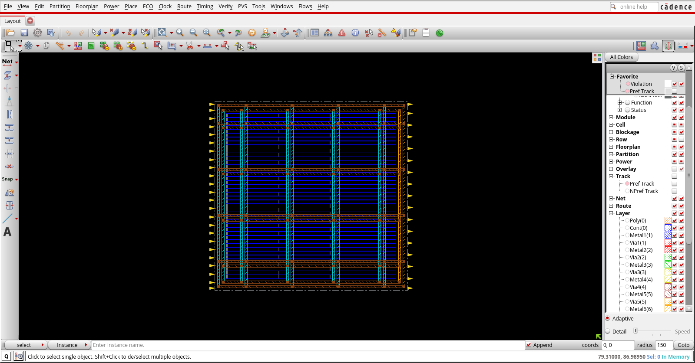

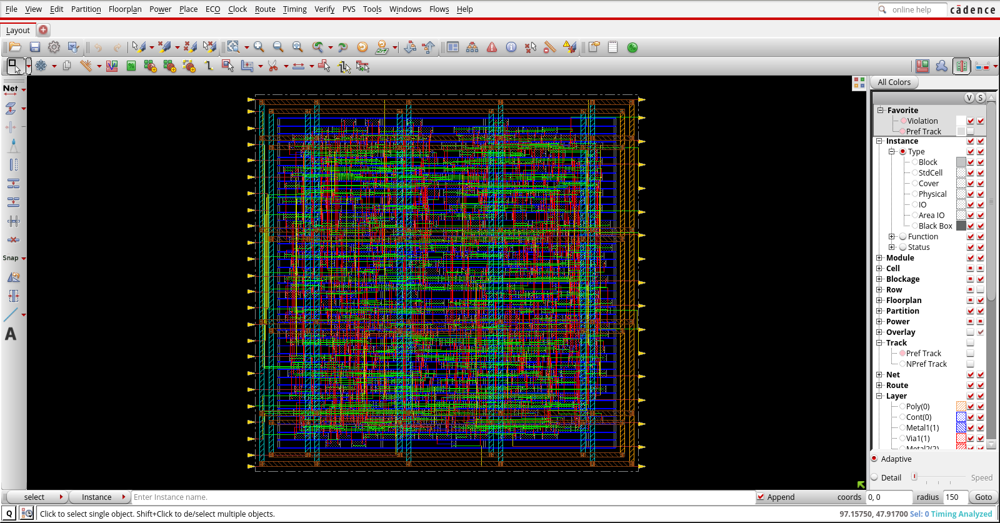

---

## 2. Placement - Global View
Standard cells placed across the core with optimized utilization and zero routing overflow.

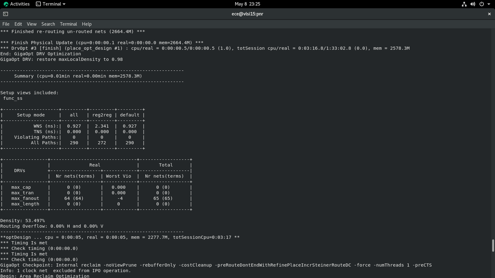

---

## 3. Placement - Zoomed View
Zoomed view showing standard cell instances and placement quality.

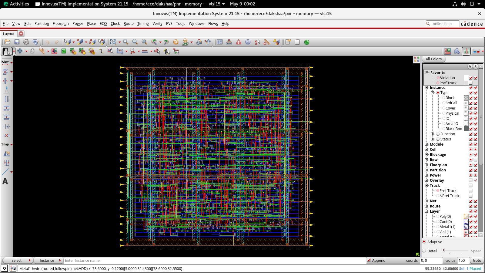

---

## 4. Congestion Analysis
Routing congestion map showing available routing resources and overflow information.

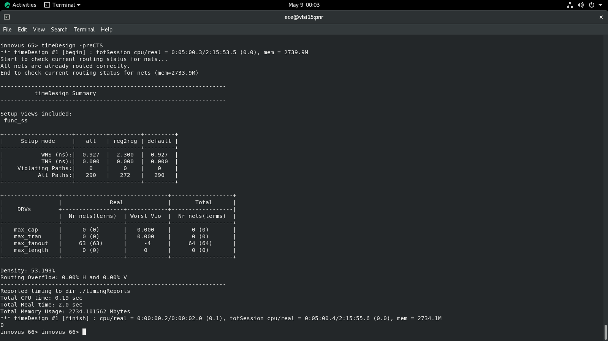

---

## 5. Clock Tree Synthesis (CTS)
Balanced clock tree generated using CCOpt for minimum skew and optimized latency.

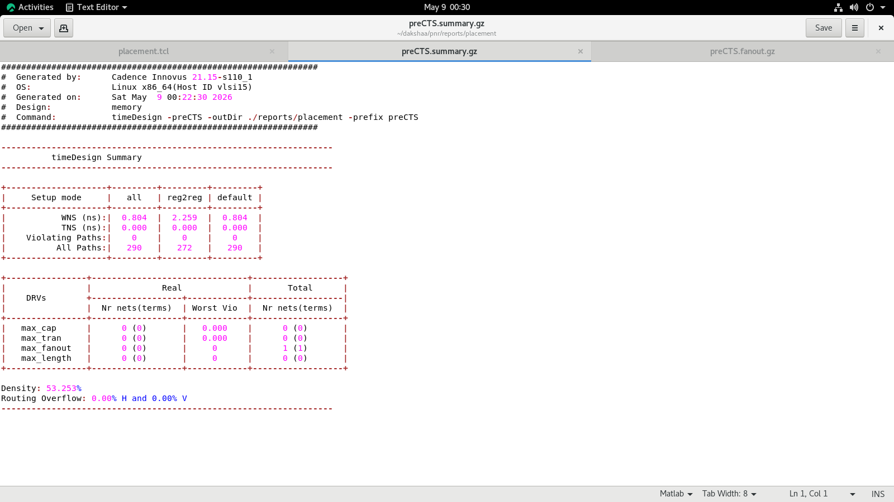

---

## 6. Post-CTS Timing Results
Timing summary after setup and hold optimization.

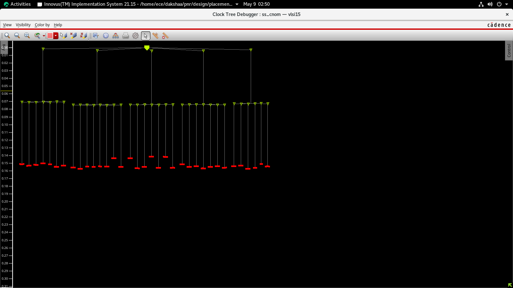

---

## 7. Routed Layout - Global View
Complete routed layout showing metal interconnections across the entire design.

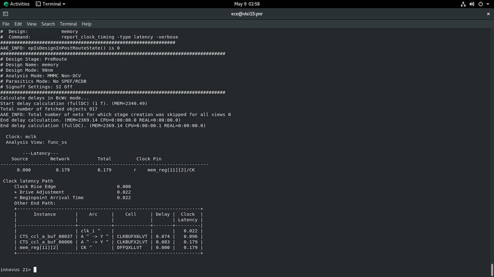

---

## 8. Routed Layout - Zoomed View
Detailed routing view showing metal layers and via connections.

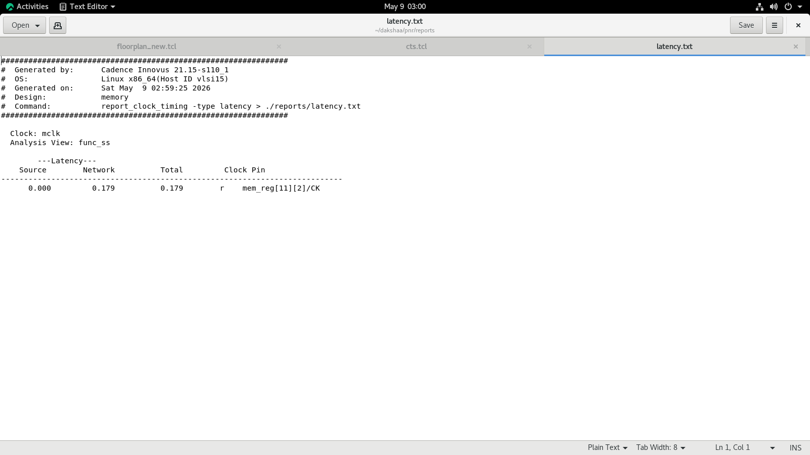

---

## 9. Physical Verification
Verification reports confirming zero DRC violations, zero connectivity violations, and zero PG short violations.

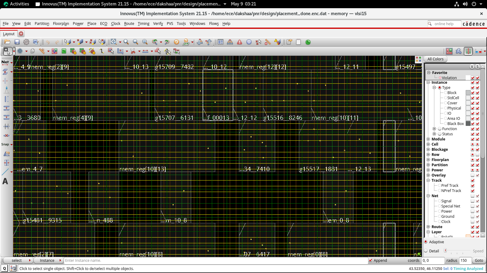

---

## 10. Final Layout
Final layout after successful timing closure and physical verification.

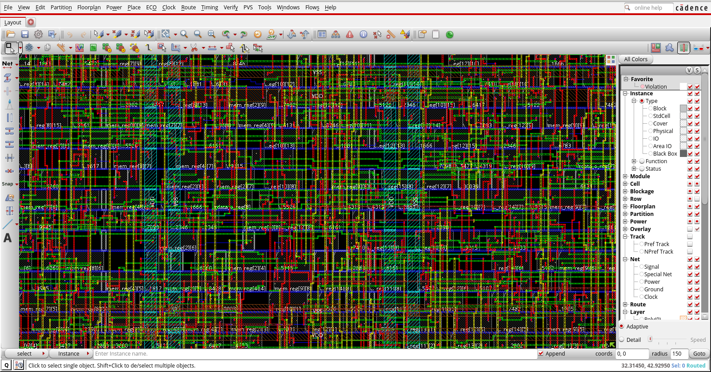

---

## 11. Final GDSII Layout
Final GDSII stream file generated after completing the RTL-to-GDSII implementation flow.

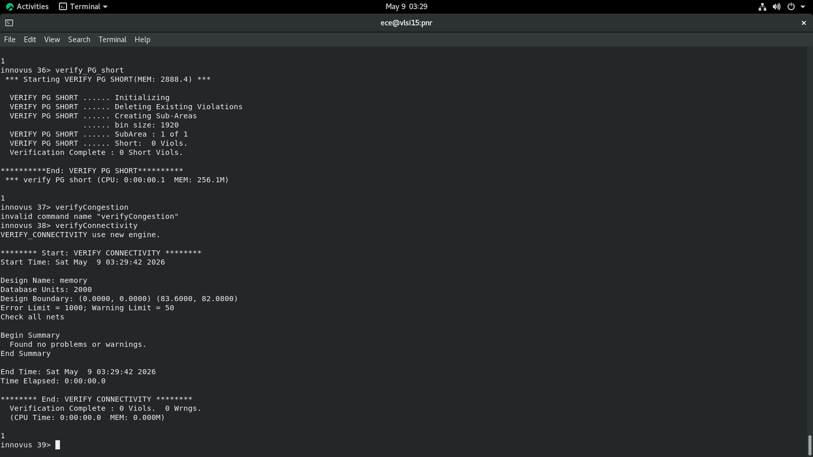
